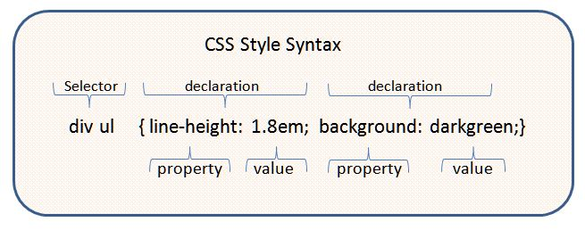

# 02 Essential CSS

## CSS

CSS is Cascading Style Sheet.

CSS is about the *style* or look of the page, not the content.

## Using CSS

* External file
* In the &lt;head&gt; of the document
* In the tag

Preferred is a file because it may apply to the entire website.

Avoid putting style in the tag if possible

## CSS Syntax

Source: [https://commons.wikimedia.org/wiki/File:CSSsyntax.jpg]()

* Declarations are surrounded by {...}
* Declarations must be separated by ;.  You may also put a ; after the last declaration.
* Selectors
    * tag names (or elements) are selectors.  Leave off the &lt; and &gt; symbols
    * ids may be used as selectors.  Start with #
    * More complete list of selectors at [https://www.w3schools.com/cssref/css_selectors.asp](https://www.w3schools.com/cssref/css_selectors.asp)

## The Cascade

Rules for adjudicating between conflicting styles can get complex.  But the general idea is:

* The most local rule applies.  For example, if the external style sheet says &lt;p> tags should be blue, but the header stylesheet says &lt;p> tags should be red, then the &lt;p> tags will be red.
* The most specific rule applies.  For example, if a rule says &lt;p> tags should be blue, but another rule says &lt;p> tags immediately after a &ul> should be red, then most &lt;p> tags will be blue, but the &lt;p> tags that follow &lt;ul> tags will be red.
* Later rules override earlier rules.
