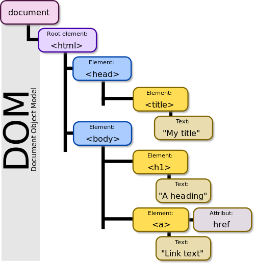

# 02A Intro to JavaScript

## History

### NetScape


The NetScape code was used as the basis of Firefox.

### JavaScript != Java

JavaScript was originally called "LiveScript."  Java was just getting started and had a lot of hype.  Netscape decided to try to ride the hype and renamed LiveScript to JavaScript

JavaScript was designed to live in the browser.

At the time people were also running Java Applets in the browser.  That proved to be a very bad idea for security and other reasons.

## More History

* [https://www.springboard.com/blog/history-of-javascript/](https://www.springboard.com/blog/history-of-javascript/)
* Browser Wars
    * Netscape lost.
    * Eventually Internet Explorer lost, too.
* Critical Event for us:
    * ECMAscript 5 
    * Late 2015.
        * Avoid using any JavaScript site dated before 2016.
        * Tread carefully around 2016 sites.

## Why learn JavaScript

* It is everywhere.  Biggest language for github repos.
* If a program doesn't use JavaScript, it probably uses JSON.
    * JavaScriptObjectNotation

### Related to JavaScript

* TypeScript
    * JavaScript with data typing
    * Compiles to minified JavaScript
* Node.js
    * Frees JavaScript from the Browser
        * Node.js is a wrapper written in C++.  
        * You give it a file written in JavaScript and it runs like a regular program outside the browser.  See [02a_simpleNode.js](02a_simpleNode.js)

## Basic JavaScript (in the browser for now)

### 30,000 foot view of JavaScript in the Browser

* JavaScript runs *client-side.*  It runs in the browser, not on the server.
    * Runs in a "sandbox" to protect the local machine.
    * Sandbox rules have been relaxed a lot since the original JavaScript rules were developed.
* JavaScript has a different syntax than HTML or CSS
* Despite what I just said, JavaScript is pretty much an extension of HTML and it uses CSS selectors heavily.
    * JavaScript is now heavily standardized on ESMAscript 6.  What runs in one major browser will probably work in any other major browser.
* Almost vital for realistic forms processing.
* JavaScript is about ***Manipulating the DOM***
    * Document Object Module  
      
      
      ```html
            <html>
                <head>
                    <title>My Title</title>
                </head>
                <body>
                    <h1>A heading</h1>
                    <a href="">Link Text</a>
                </body>
            </html>
      ```
      


### References: 

* [http://griff.vn/csc346book](http://griff.vn/csc346book) See chapter 8.
* In some ways JavaScript is almost part of HTML5.  So w3schools is a pretty good reference. [https://www.w3schools.com/js/](https://www.w3schools.com/js/)

### Syntax

JavaScript syntax is loosely based on Java syntax.  Sort of.

* case sensitive
    * same style conventions for case
* Comments include // and /*...*/ formats
* Blocks are like Java.  Use { and }
* Identifier naming rules are about the same as Java
    * May start with letters, underscore, and $
    * Following characters include the above plus digits
* There are [reserved words](https://www.w3schools.com/js/js_reserved.asp), but some of them are different.  Also note the Objects, Properties, and Methods.
* Semicolons
    * Technically not needed at the end of lines
    * Put them at the end of lines anyway.  Some minifiers require them to work properly

### Including JavaScript on the page

***Always open the console when developing in JavaScript***

#### Three ways to put JavaScript on the web page

```html
<script>
    console.log("Hello, World");
</script>

<script type="text/javascript">  //Attribute is no longer needed in HTML5.  The script element defaults to JS.
    console.log("Hello, World");
</script>

<script src="helloWorld.js">

```

### Placement

Placement can be tricky in simplistic pages.  

* Code that will execute when the page loads go in the body element
* Functions generally go in the head element
* It can get tricky.
    * Sometimes body code needs to be loaded at the bottom of the page so it is after the elements it is working on.
    * Things like JQuery can help by forcing javascript to delay executing until all page elements are loaded and ready
    * In practice real-world apps use a framework like Angular or React.  
    * Frameworks sidestep the placement issue entirely.

### Variables

* var -- Creates a global variable
* let -- Creates a local variable
* const -- Creates a constant (always global, I think)

Variables are type-fluid in JavaScript.  That can be a problem and is one reason for TypeScript in many newer frameworks like Angular.

### Data Types

|Type|Description|Example
|---|---|---|
String|A series of characters within quotation marks|"Welcome to Belhur Product Page"
|Number|Any number not within quotation marks|7.13 or -8|
|Boolean|Logical true or false|True|
|Null|Devoid of any valueNullObjectCollections of properties and methodsFunction|null|
|Function |function definition|&nbsp;|
|Array|A group of objects with the same attributes|&nbsp;|
Undefined|A variable that has been declared but does not have a value assigned| var example;|

### Output methods

* document.write() -- Rarely used in practice
* console.log() -- Used for debugging mostly
* alert() -- Pops up a box to annoy users
* ***Manipulating the DOM*** --- The most common method.
